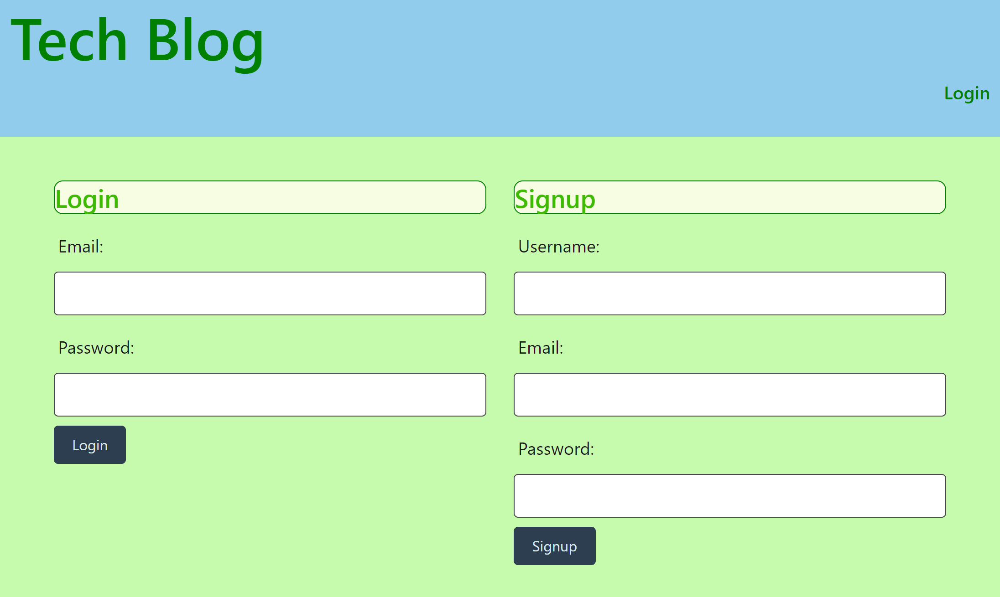
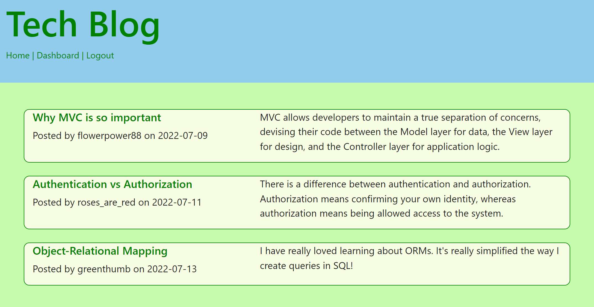

# Tech Blog

## Description

This repository contains a full stack tech blog where users can login to make posts and comments related to all-things-tech. The application follows the MVC paradigm in its architectural structure, uses Handlebars.js as the templating language, Sequelize as the ORM, and express-session npm package for authentication. The app is deployed live on Heroku. 

## Usage

Through the terminal, install the required tools using the following: 

```
npm i
```
Through the terminal, seed the database using the following: 

```
npm run seed
```

Through the terminal, initialize the application using the following:

```
npm run start
```

This website can be accessed at 

Below are some screenshots of the deployed website. 



